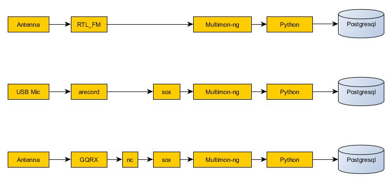

% Open Source GIS with Raspberry Pi and Radio
% Matt McCormick
% February 7, 2017

## Introduction

- KE8CRV, General License
- Former Volunteer Firefighter/EMT in Western U.P.
- Department Analyst with Michigan State Police/Emergency Management Homeland Security Division
- Responsibilities:  Mapping for SEOC, GIS Servers, Python Programming, MI CIMS Development

## What

- Open Source Geographic Information System (GIS)
- Hosted on single board computers (Raspberry Pi/ODroid C2)
- Capable of being updated via radio frequency (RF)
- Operates without internet access

## Why
- Wanted open source, low cost, fun project to learn new technology
- Interoperability with commercial solutions
- GIS can resolve formatting issues
- Databases can support concurrent transactions

## Current Technology

| Current Technology								| Pro							| Con                       	|
|---------------------------------------------------|-------------------------------|-------------------------------|
| ESRI ArcGIS Server and Portal						| Widley used					| Expensive                 	|
|                                                   | Discounts for 503c			| System Requirements       	|
|                                                   | Disaster Response Program 	|                           	|
|                                                   |                   			|                           	|
| ESRI ArcGIS Online                                | Easy to use         			| Requires internet access    	|
|                                                   |                   			|                           	|
| Google Maps/Earth                                 | Free	            			| Lack of GIS analytics     	|
|                                                   | Easy to use       			| Relies on internet access 	|
|                                                   | 				       			| Single computer use       	|
|                                                   | 				       			|       						|
| Many Others                                       | Specialized functions			| Difficult to find		  		|

## Potential Uses

- Make paper maps in the field with US National Grid coordinates
- Alerts when people enter/exit certain areas (geofences)
- Mobile apps for data collection on scene
- Rubbersheet maps received via slow scan tv or other methods
- Export maps in image to send over slow scan tv or other methods
- Use elevation data to site selection for antenna/towers
- Triangulation/Trilateration
- Line of sight analyses
- Add data to US Topo Maps and republish for local needs
- Keep track of Callsigns/Identifiers and get alerts/reports when no longer receiving packets
- Join point layer to other tables of information based on callsign
- Log all data but display only most recent data using database views
- Use multiple devices to listen and log several frequencies

## GIS

| Application        	| Function                                                 	|
|--------------------	|---------------------------------------------------------- |
| Geoserver          	| GIS Data Server                                           |
| PostgreSQL/PostGIS 	| Spatial Database                                          |
| GeoNode            	| Web Mapping Portal/Catalog                                |
| QGIS               	| Desktop Application for Spatial Analysis, Map Production  |
| Arbiter              	| Android app for mobile data collection					|

## Single Board Computers

| Model          	| CPU     	| Cores 	| OS     	| Ram    	| Ethernet     	| Storage 	| Cost 		|
|----------------	|---------	|-------	|--------	|--------	|--------------	|---------	|-----------|
| Raspberry Pi 2 	| 700 Mhz 	| 2     	| 32 Bit 	| 512 MB 	| 10/100       	| SD      	| $30.00	|
| Raspberry Pi 3 	| 1.2 Ghz 	| 4     	| 32 Bit 	| 1 GB   	| 10/100       	| SD      	| $35.00	|
| ODroid C2      	| 1.5 Ghz 	| 4     	| 64 Bit 	| 2 GB   	| 100/100/1000 	| SD/eMMC 	| $41.00	|
|                	|         	|       	|        	|        	|              	|         	|

## Radio Hardware

- Software Defined Radios: RTL2832U/HackRF One
- Baofeng UV5R
- Kenwood TH-D74A

## Radio Software

- GQRX
- Multimon-ng
- RTL-SDR/Gnu Radio

## Miscellaneous 

- 8 Port Gigabit Ethernet Switch
- 12A USB Powersupply
- SD Cards
- Nagios Monitoring

## GIS Data

- Data may have restrictions preventing sharing: Federal HSIP Gold
- Data quickly becomes outdated
- Metadata is often lacking
- Some data can be downloaded directly, some cannot
- Created python script to download ESRI Feature Services for offline use
- Use scheduled task/cron job to automatically keep data updated

## GIS Data

- [State of Michigan Center for Shared Solutions OpenPortal](http://gis.michigan.opendata.arcgis.com/)
    - County/City/Township Borders
	- All Michigan Roads
	- Lakes/Rivers
	- State Parks
- [Homeland Infrastructure Foundation-Level Data](https://hifld-dhs-gii.opendata.arcgis.com/)
    - Hospitals
	- Communication Towers
	- Federal Lands
- [OpenStreetMap](http://wiki.openstreetmap.org/wiki/Downloading_data)
    - Basemaps
	- Building Footprints
- [More...](http://www.ke8crv.com)

## Data Sources

| Layer		     			| Source				                                      		|
|---------------------------|-------------------------------------------------------------------|
| UTM Zones					| [http://earth-info.nga.mil/GandG/coordsys/grids/universal_grid_system.html](http://earth-info.nga.mil/GandG/coordsys/grids/universal_grid_system.html)
| MI Snowmobile Trails		| [http://www.michigan.gov/dnr/0,4570,7-153-10365_14824-31074--,00.html](http://www.michigan.gov/dnr/0,4570,7-153-10365_14824-31074--,00.html)

## Block Diagram

## Build Process

- Download and install OS to SD/eMMC
- Configure network
- Add hardware/application monitoring
- Install applications and depedencies
- Separate Geoserver and Postgres from GeoNode
- Configuring applications
- Loading Data
- Setting up work station with radio applications/scripts

## Demo

## Problems

| Problem       			| Possible Solution(s)                                      |
|---------------------------|---------------------------------------------------------- |
| Disk space/writes         | Add a SSD/Platter hard drive                              |
|							| Separate partitions for /tmp and /var/www/geonode			|
| Lack of real time clock	| Add RTC or use GPS to drive NTP							|
| No backups				| Build a Network Attached Storage device					|
| Performance				| Java VM tweaks											|

## Future

- Bare metal hypervisor and virtual machines
- Solar Power
- Backups and Database replication
- Geofencing with ElasticSearch/Redis databases
- "Cluster/HPC" for sensor data streams

## Questions?

- Matt McCormick
- mccormickm@michigan.gov
- ke8crv@gmail.com
- www.ke8crv.com

